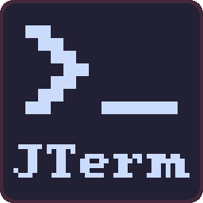

<p align="center">

</p>

# JTerm - An in-game console for Godot 4

A simple console system with automated argument name and type recognition.

## Command registration

Console commands can be registered from any node in the scene, and should be unloaded whenever the node in question exits the tree to avoid lingering invalid commands.

```gdscript
func _ready() -> void:
    Console.add_command("example", _command_example, "Example command showcasing argument typing")

func _exit_tree() -> void:
    Console.remove_command("example")

func _command_example(arg, typed_arg: int, optional_arg: bool = true) -> void:
    # Do whatever you want!
    pass
```

## Console GUI

JTerm comes with a simple pre-built GUI scene that can be found at `addons/jayrude/console/gui/console.tscn`. The GUI is not autoloaded by default to allow you to build your own, or only enable it in certain circumstances.


